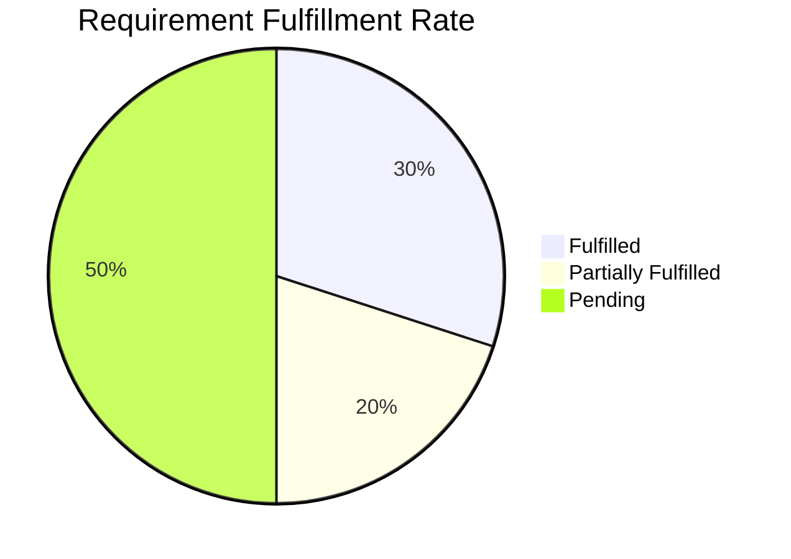

# UniNest-AI Project Analysis Report

This report evaluates the current codebase of the **UniNest Campus Recruitment Portal** against the hackathon project specification to identify what features have been implemented (Fulfilled), which are partially developed (Partially Fulfilled), and which are missing (Pending).

---

## 📊 Summary of Fulfillment Status

The core backend structure (Express, Prisma, PostgreSQL) and basic frontend screens (Next.js App Router for Students and Companies) have been built. However, the **University Module** (the primary controller of the placement process) and the **Admin Module** (tenancy and SaaS billing) are completely missing in both the database schema and the UI.

---

## 1. University Module (Status: 🔴 Majorly Pending)

The University is intended to be the controlling authority of the platform, but it is currently not implemented.

| Feature Requirement | Status | Details / Technical Findings |
| :--- | :---: | :--- |
| **Student Onboarding & Management** | 🔴 Pending | No bulk Excel/CSV upload, no PRN-based manual entry, and no credential sharing code exists in the backend or frontend. |
| **Verification Workflow** | 🔴 Pending | No email/phone OTP verification logic or onboarding mail integrations exist in the auth controller. |
| **Automated Notifications** | 🔴 Pending | No mailing service (like Nodemailer or SendGrid) is set up to notify students. |
| **Department & Class Management** | 🔴 Pending | No hierarchical schema for `Department ➔ Sub-Department ➔ Class` exists in the database. |
| **Company Profiles (Creation/Invite)** | 🔴 Pending | No endpoints or frontend workflows allow the university to invite or create company profiles. |
| **Placement Drives Workflow** | 🔴 Pending | Drives are currently created directly by companies without university drive requests, approvals, or overrides. |
| **Student Filtering & AI Suggestions** | 🟡 Partially | Simple filters (Dept, Batch, CGPA) exist in the backend `studentRepository`, but there is no AI Suggestion Engine or Admin override UI. |
| **Invitations & Visibility Levels** | 🔴 Pending | No backend data model supports drive invitation states or controls visibility levels. |
| **Resume Rules Configuration** | 🔴 Pending | No templates or configuration screens allow setting rules for mandatory resume fields. |
| **Profile Verification & Locking** | 🟡 Partially | The database schema has fields like `isProfileVerified`, `verificationStatus`, `rejectionReason`, and `isProfileLocked` in the `Student` model, but no endpoints or UI views exist for University admins to verify or lock profiles. |
| **Company View Toggle** | 🔴 Pending | No toggle exists in the frontend/backend to hide unverified fields from companies. |
| **Analytics & Insights** | 🔴 Pending | No analytics dashboard or predictive charts are implemented for universities. |

---

## 2. Student Module (Status: 🟡 Partially Fulfilled)

Students can build profiles, upload resumes, run AI matching, and negotiate offers, but lacks resume building and document upload features.

| Feature Requirement | Status | Details / Technical Findings |
| :--- | :---: | :--- |
| **Digital Profile** | 🟢 Fulfilled | Students can create and edit education, skills, projects, achievements, and work experience. |
| **Supporting Document Uploads** | 🔴 Pending | Currently, the app only supports uploading a single PDF resume. Uploading marksheets or certificates is not implemented. |
| **Drag-and-Drop Resume Builder** | 🔴 Pending | No visual resume builder exists; the app relies on manual file uploads. |
| **Resume Export Templates (PDF/DOC)**| 🔴 Pending | No PDF/DOC resume compilation or export engine is implemented. |
| **ATS Resume-JD Matching** | 🟢 Fulfilled | Implemented in [atsService.ts](file:///C:/Users/Chirag%20Vasava/Downloads/Personal/Final%20Projects/UniNest-AI-main/UniNest-AI-main/backend/src/services/atsService.ts) using Gemini 1.5 Flash (with local heuristic keyword overlap fallback) and exposed at `/resumes/:id/match`. |
| **Resume Improvement Suggestions** | 🔴 Pending | AI content rewrites and tips for resumes are not implemented. |
| **Drive Participation** | 🟡 Partially | Students can browse and apply for eligible drives, but the invite-based acceptance/rejection flow is missing. |
| **Offer Management & Negotiations**| 🟢 / 🟡 | Students can view, accept, and reject offers. The database schema supports `counterOfferText` and tracks negotiation status logs, but the UI for students to submit counter-proposals is minimal. |
| **Verification Correction** | 🟡 Partially | The database supports displaying rejection comments, but the resubmission and tracking UI is incomplete. |

---

## 3. Company Module (Status: 🟢 Mostly Fulfilled)

The Company module is the most complete, allowing recruiters to post drives, review candidates with AI, and manage offers.

| Feature Requirement | Status | Details / Technical Findings |
| :--- | :---: | :--- |
| **Profile Management** | 🟢 Fulfilled | Recruiter profile CRUD operations (Name, Sector, Website, Logo, Website) are fully functional. |
| **Drive Creation** | 🟢 Fulfilled | Companies can post recruitment drives with specific eligibility criteria (CGPA, batches, departments, online/offline format). |
| **Request Drives** | 🔴 Pending | Since the University module is missing, companies cannot submit drive requests to universities. |
| **Candidate Screening** | 🟢 Fulfilled | Recruiters can view drive applicants, change pipeline status, and download individual resumes. |
| **AI Smart Screening** | 🟢 Fulfilled | Backend `/applications/drive/:driveId/ats` compiles ATS compatibility scores and matches candidate resumes to JDs. |
| **Offer Workflow** | 🟢 Fulfilled | Extending offers and tracking their response status (Pending, Accepted, Rejected, Countered) is fully operational in the database and API. |
| **AI Offer Email Generator** | 🔴 Pending | No email draft generation exists. |

---

## 4. Admin Module (Status: 🔴 Fully Pending)

The SaaS Admin panel is completely un-implemented.

| Feature Requirement | Status | Details / Technical Findings |
| :--- | :---: | :--- |
| **University & Company Management**| 🔴 Pending | Multi-tenant onboarding, tenant suspension, subscription plans, and billing configurations do not exist. |
| **Student & Drive Oversight** | 🔴 Pending | Global student search and placement drive monitoring interfaces are missing. |
| **Analytics & Placement Forecasting**| 🔴 Pending | No forecasting or placement probability algorithms have been implemented. |
| **Fraud Detection** | 🔴 Pending | No duplicate resume check or data inconsistency detection rules exist. |

---

## 🛡️ Technical Stack & Delivery Requirements Checklist

| Requirement Spec | Status | Details |
| :--- | :---: | :--- |
| **Preferred Stack** | 🟡 Mixed | Expected **MSSQL + Sequelize**. The project uses **PostgreSQL + Prisma** (allowed as an alternative under NestJS/Prisma, but here it is Express + Prisma). |
| **Auth** | 🟡 Partially | JWT is fully implemented. **OTP authentication** (Email/Phone) is missing. |
| **API Conventions** | 🟢 Fulfilled | Base path `/api/v1` is implemented. JSON response structure matches: `{ success: true, data: {}, message: "" }`. |
| **Postman Collection** | 🔴 Pending | The required `UniNest.postman_collection.json` file is **missing** from the workspace root. |
| **GitHub Deliverable** | 🟢 Fulfilled | The directory is structured with `/backend` and `/frontend` and has been initialized as a git repository. |
| **Hosting** | 🟢 Fulfilled | Backend is successfully deployed to **AWS EC2** with Nginx, and frontend is deployed on **Vercel**. |
