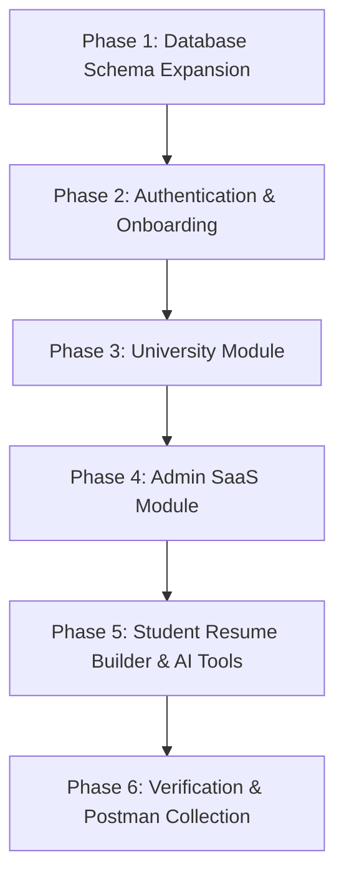

# Implementation Plan - Read-Only Browsing with Login Enforcement & Deployment Settings

This plan outlines the roadmap, database changes, and endpoints required to implement all missing features of the **UniNest Campus Recruitment Portal** (primarily the University, Admin, and missing AI/Resume features).

## 💡 Tech Decisions & Credentials (Aligned)

1. **Database**: We are sticking with **Neon PostgreSQL** (current cloud setup).
2. **Predefined Student CSV Columns**:
   `First Name`, `Last Name`, `Email`, `Roll Number`, `Phone`, `Department`, `Batch`, `CGPA`, `College`
3. **Mailing (Nodemailer)**:
   We will implement Nodemailer. It can be integrated for free using:
   - A Gmail account with a custom "App Password" (using Google's free SMTP).
   - Or, a free tier of a delivery API like **Resend** (3,000 emails/month free).
4. **SMS (Twilio)**:
   We will write the real Twilio API integration. To keep the app 100% free and easy to test:
   - If `TWILIO_ACCOUNT_SID` is present in `.env`, the system will send real SMS.
   - If absent, it will fall back to printing the SMS OTP to the backend console logs.

---

## 🗺️ Roadmap & Implementation Order

We will build the modules in order of database dependency, starting with schema design and ending with advanced AI helpers.

---

## 🛠️ Phase-by-Phase Technical Details

### Phase 1: Database Schema Expansion (Prisma)
We need to model the University, Admin structure, and class hierarchy.

#### [MODIFY] [schema.prisma](file:///C:/Users/Chirag%20Vasava/Downloads/Personal/Final%20Projects/UniNest-AI-main/UniNest-AI-main/backend/prisma/schema.prisma)
1. **New Models**:
   - `University`: Onboarded universities.
   - `Department`, `SubDepartment`, `Class`: Structural hierarchy inside a university.
   - `FacultyAdmin`: University administrators.
   - `OTPVerification`: Log for pending email/phone OTP verification.
   - `SubscriptionPlan`, `Billing`: For SaaS tenant management.
2. **Schema Associations**:
   - Link `Student` to a `Class` and `University`.
   - Link `Company` (representing drive requests) to `University` for approval routing.

---

### Phase 2: Authentication & Onboarding
1. **Backend**:
   - Extend `authController.ts` to support **University registration** and **Faculty Admin logins**.
   - Create OTP generation and verification logic (simulated in logs, or using Twilio/Nodemailer).
2. **Frontend**:
   - Add **University Registration** and **Faculty Admin Login** layouts on the login page.
   - Create an OTP verification overlay page for first-login student validations.

---

### Phase 3: University Module
1. **Student Onboarding**:
   - **Bulk Upload**: Implement a CSV parser on the backend (`multer` + `csv-parser` or `xlsx`) to parse uploaded lists and bulk-insert `User` and `Student` profiles linked to the university.
   - **Manual Invite**: Endpoint `POST /api/v1/universities/students` to invite single students by email/PRN.
2. **Hierarchy Management**:
   - Create CRUD endpoints `/api/v1/departments`, `/api/v1/sub-departments`, `/api/v1/classes`.
   - Build a University Dashboard frontend to manage these structural lists.
3. **Company & Drive Routing**:
   - **Invitations**: Create an invitation model so universities can invite companies to their portal.
   - **Approvals**: Add a Company-to-University drive request API. Companies request drives; universities approve them, altering `isActive` or `isApproved` in the schema.
4. **Verification & Locks**:
   - Add endpoints to Lock/Unlock student profiles and verify/reject resumes with custom reviewer comments.

---

### Phase 4: Admin SaaS Module (UniNest Core Team)
1. **Backend**:
   - Dashboard endpoints to view global statistics: active universities, active companies, placements, and billing plans.
   - Tenant control APIs: `/api/v1/admin/tenants/:id/suspend` or `/approve`.
2. **Frontend**:
   - Create `/admin/dashboard` showing global search, user list filters, tenant lists, and billing metrics.

---

### Phase 5: Student Resume Builder & AI Tools
1. **Resume Builder**:
   - Build a modular drag-and-drop form (Personal Info, Education, Skills, Projects) on the frontend.
   - Add PDF rendering templates (`react-to-print` or `jspdf`) to allow exporting the profile to multiple standard single-page resume layouts.
2. **AI Improvements & Generators**:
   - Add a resume improvement helper utilizing Gemini 1.5 Flash to suggest rewrites for projects/achievements.
   - Implement an **AI Offer Email Generator** on the company dashboard to auto-generate placement letters.

---

### Phase 6: Postman Collection & Walkthroughs
- Create `UniNest.postman_collection.json` containing separate request folders for Student, Company, Drive, University, and Admin actions.
